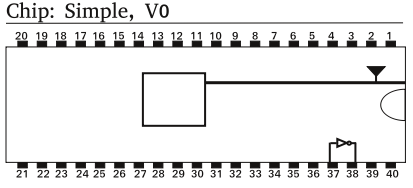

PSU Chip Lab
====

PennState Simple Processor
=====

`Simple` is a microprocessor developered at the Penn State University Chip Lab.
This repository contains documentations and programs associated with the microprocessor.
Included is [`PAS`](/assembler) the assembler, the loader, and product specs.

Brave explorers are very welcome to take a look around!

Simple, V0
====

`Simple, V0` is the first version of the chip.
The full datasheet with pin-out and instructions can be [found here](/specs/v0/ChipV0.pdf).

[`PAS`](/assembler) can be used to assemble programs for this chip. You can find a set of [sample programs here](/testcases/v0).

PAS - Penn State Assembler
===

[`PAS`](/assembler) is the assembler program we developed for the Simple Chip series.
You can find more information about it [here](/assembler).
